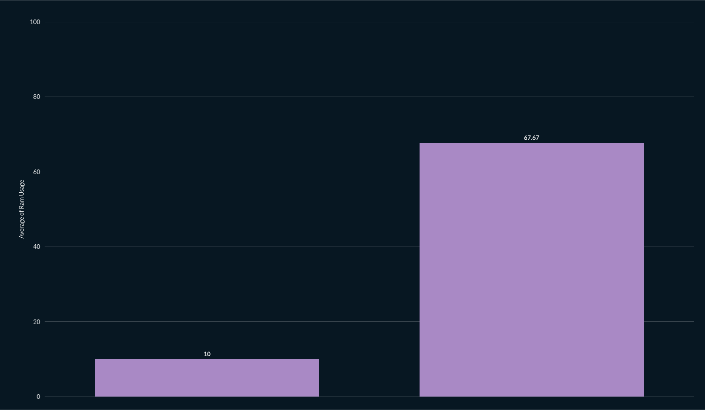
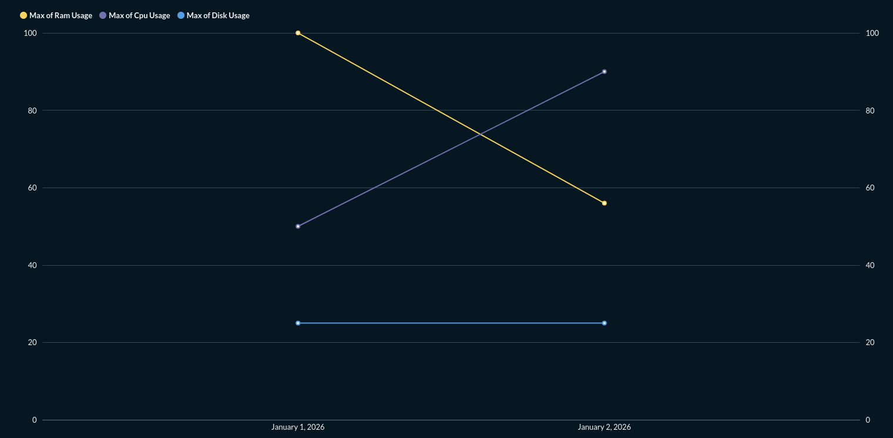
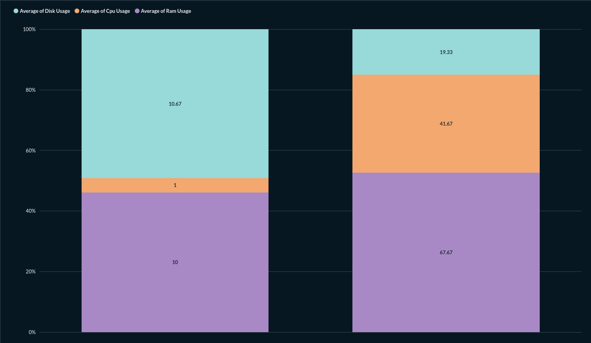
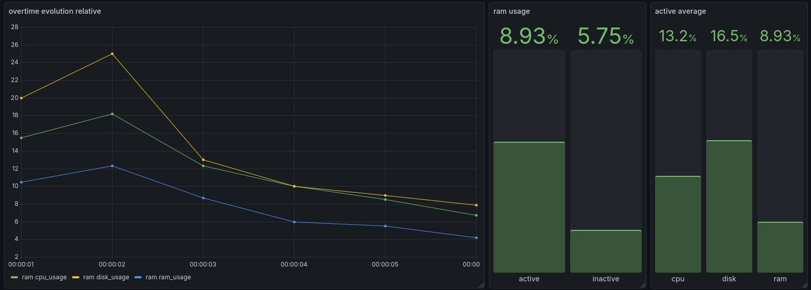

> report n°005 | 2026‐01‐26

# Context

We have a need to visualize raw data that we collect from our pluggins to be able to make reports about them and their evolution, we chosed to explore Metabase as an option for its presumed ease of use and Grafana for its precise control of how to make data looks. 

The pipeline we work with is:
- plugins pump out data in json  
- a script put everything in a sqlite database  
- the visualisation tool (Metabase or Grafana) is used to extract relevant charts
- a performance report is written

Pre checks done :
- is open source and free to use | both AGPL-3.0 license

<!-- truncate -->

# Objectives

features we want to get for our project :
- make a visualisation of raw data to image performance reports
    - a percentage scale (comparing two values) 
    - curves to show overtime evolution of a value (with legible legends)
    - a percentage chart to compare the proportion of multiples values (cpu, ram, memory)

feature the technology must have :
- easy exploitation of sqlite data
- have an easy docker pipeline
- export generated charts in the following formats:
    - png
    - svg

# Time-Frame

> 30 minutes  
> setting up both technologies through docker

> 15 minutes per tool  
> checking the required features   

> 1 hour per tool  
> making the thee diffirent charts stated in the objective section

> 15 min  
> write **Context**, **Objectives** and **Time-Frame** part of report

> 20 min per tool  
> write **Results** part of report

> Total  
> 3 hours 55 minutes

# Results

To see the actual results scroll to the bottom

## Metabase

- a percentage scale comparing two values    
- curves to show overtime evolution of a value (with legible legends)   
- a percentage chart to compare the proportion of multiples values (cpu, ram, memory)   
- easy exploitation of sqlite data   
- easy docker pipeline   
- export generated charts in a image format. Can export in png but the exported result is unusable, the only working way is to take a screenshot of the result.  

Aditional remarks :

Easy to make a dashboard with all the aformentioned quarry, can be usefull for easy access when making a performance report.

## Grafana

- a percentage scale (comparing two values)   
- curves to show overtime evolution of a value (with legible legends)   
- a percentage chart to compare the proportion of multiples values (cpu, ram, memory)   
- easy exploitation of sqlite data   
- easy docker pipeline   
- a plugin to export a dashboard as an image exist but I didn't manage to install it in the time frame I had, taking a sceenshot is a good workaround

Aditional remarks :

The customisation of the looks of the curves is really good.

## Overall comparison

Metabase is an easier tool to acomodate but with less control over the result.  
The image export function of Metabase is unusable while the one of grafana is just a bit long to set up.  
They can both create really good dashboards.  

Overall Metabase might be a bit easier to use but grafana has a lot more customisation option and that's what we are looking for the most.

## Follow-up

Going forward we are going to use grafana.

This leads to 3 things to do :
- create a script to translate json into sql
- create a clean docker file
- create a dashboard with the necesarry curves
- create a documentation to explain how everithing works

## Result images

> metabase percentage scale  

> metabase overtime evolution  

> metabase percentage chart

> grafana dashboard
